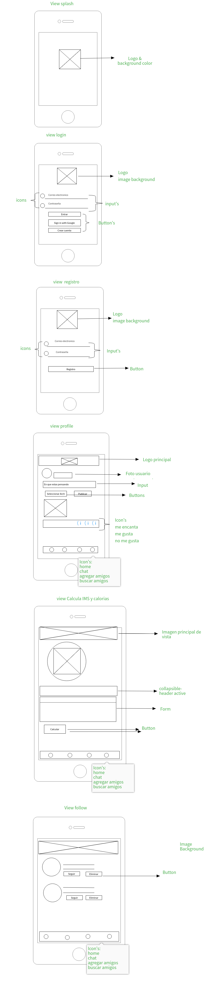

<h1>PLANIFICACIÓN:</h1>

-Introdución

En la actualidad, prácticamente todas las personas cuentan con dispositivos móviles personales con los cuales interactúan todo el día en sus tareas cotidianas. Aquí es donde nace una gran oportunidad para las empresas de estar aún más cerca de sus clientes y crear otro canal de venta por lo cual nuestro cliente nos pide desarrollar una aplicación móvil para promover una alimentación sana y abrir un nuevo canal de venta desde donde los usuarios podrán realizar compras de tus productos que satisfagan sus necesidades.
Y se solicita crear una red social que sirva para las personas que están interesadas de comer sanamente interactúen dentro de la red compartiendo recetas, tips buenas prácticas de alimentación, productos y servicios.

- Objetivo:

Interactuar todo el todo el tiempo con las personas en sus tareas cotidianas y hábitos alimenticios y así  aprovechar una gran oportunidad para las empresas de estar aún más cerca de sus clientes y  entender sus necesidades para crear un canal de venta.
Y así tambien promover una alimentación sana a través de la tecnología  por medio de una red social,Por que cada  día los problemas relacionados a la alimentación no solo son por carencias nutricionales como la desnutrición, si no también por excesos como la obesidad.

- Cronograma:
https://docs.google.com/spreadsheets/d/17U1AdLHkRQadk6iqxyk-o1uGh7xvNf2S2KeSbhUuMQA/edit#gid=0

<h3> Definición de Requisitos. </h3>

Durante esta fase, se definirán los conceptos, la funcionalidad y usabilidad de la aplicación se definen. Dando como resultado el concepto y las expectativas de diseño .

Herramientas utilizadas:

Pizarras, papel y lápiz

<h3> Experiencia del usuario y aplicación de diseño de flujo de trabajo. </h3>

Durante esta etapa, se definen los flujos de trabajo, el contenido y las interacciones de la aplicación.
Dando como resultado: Wireframes, maquetas, y una red social.

Tools:

Software de prototipado

<h3>Diseño Gráfico</h3>
Wireframes y maquetas

Dando como resultado:

Los activos de imagen y guías de estilo

Herramientas utilizadas:

Software de edición de gráficos

<h3>Desarrollo</h3>

Se desarrollan los wireframes y maquetas,  para que la aplicación reciba su utilidad funcional.

El desarrollo se ha comunicado en gran medida a través de conceptos abstractos y las imágenes estáticas.

Dando como resultado: Aplicación Terminada
Herramientas utilizadas: Framework, Librerías
